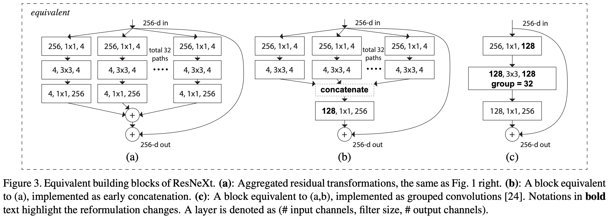

[TensorFlow 2] Aggregated Residual Transformations for Deep Neural Networks
=====

## Concept
<div align="center">
    
  <p>The three ways for construct ResNeXt block [1].</p>
</div>

## Performance

|Indicator|Value|
|:---|:---:|
|Accuracy|0.99370|
|Precision|0.99371|
|Recall|0.99364|
|F1-Score|0.99367|

```
Confusion Matrix
[[ 977    0    1    0    0    0    0    0    2    0]
 [   0 1129    2    0    0    0    1    2    1    0]
 [   0    1 1026    0    1    0    0    3    1    0]
 [   0    0    2 1007    0    1    0    0    0    0]
 [   0    0    0    0  976    0    1    0    0    5]
 [   1    0    0    4    0  883    2    0    0    2]
 [   1    1    0    0    1    1  953    0    1    0]
 [   0    1    2    0    0    0    0 1024    1    0]
 [   2    0    2    1    0    0    0    2  965    2]
 [   0    1    0    0    4    2    0    3    2  997]]
Class-0 | Precision: 0.99592, Recall: 0.99694, F1-Score: 0.99643
Class-1 | Precision: 0.99647, Recall: 0.99471, F1-Score: 0.99559
Class-2 | Precision: 0.99130, Recall: 0.99419, F1-Score: 0.99274
Class-3 | Precision: 0.99506, Recall: 0.99703, F1-Score: 0.99604
Class-4 | Precision: 0.99389, Recall: 0.99389, F1-Score: 0.99389
Class-5 | Precision: 0.99549, Recall: 0.98991, F1-Score: 0.99269
Class-6 | Precision: 0.99582, Recall: 0.99478, F1-Score: 0.99530
Class-7 | Precision: 0.99033, Recall: 0.99611, F1-Score: 0.99321
Class-8 | Precision: 0.99178, Recall: 0.99076, F1-Score: 0.99127
Class-9 | Precision: 0.99105, Recall: 0.98811, F1-Score: 0.98958

Total | Accuracy: 0.99370, Precision: 0.99371, Recall: 0.99364, F1-Score: 0.99367
```

## Requirements
* Python 3.7.6  
* Tensorflow 2.1.0  
* Numpy 1.18.1  
* Matplotlib 3.1.3  

## Reference
[1] Saining Xi et al. (2016). <a href="https://arxiv.org/abs/1611.05431">Aggregated Residual Transformations for Deep Neural Networks</a>. arXiv preprint arXiv:1611.05431.
